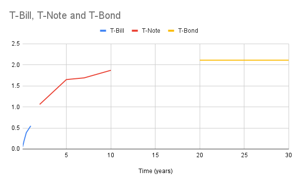

# Homework 3

> Gus Lipkin

## Chapter 7

1. Gross domestic product is equal to the sum of all of the following except **personal savings in banks**.
   - D
2. Personal consumption expenditures (PCE) include **individual expenditures for durable goods**.
   - A
3. Most income for the Federal Government comes from **individual income taxes**
   - B
4. Which of the following expenditures account for the largest part of the Federal budget?
   - C – **direct benefits to individuals**
5. The most important savings surplus unit in the economy is **the savings of individuals**.
   - A
6. Motivations for individuals to deposit money into a savings account include **return on investment**
   - B
7. Which of the following is the most liquid form of savings?
   - A – **cash balances**
8. The proportion of after-tax profits retained by corporations.
   - B – **undistributed profits**
9. The major factors which influence the level of savings are the level of **income, economic expectations, cyclical influence, and the life stage of the individual saver**.
   - B
10. A saver who chooses securities as a savings medium and desires maximum safety of 
    principal buys **government bonds**.
11. A home loan made to a borrower with a relatively high credit score indicating the likelihood 
    that loan payments will be made as agreed to **prime mortgage**.
    - B
12. A mortgage with a constant interest rate with a constant periodic payment over the real estate 
    loan’s life.
    - C – **Fixed-rate mortgage**
13. A home loan made to a borrower with a relatively low credit score indicating the likelihood 
    that loan payments might be missed when due. 
    - D – **Subprime mortgage**

## Chapter 8

14. In an inflationary period, interest rates have a tendency to **rise**.

    - A

15. A basic source of loanable funds is **current savings that flow through financial institutions**.

    - A

16. If the nominal interest rate is 8% and the risk-free rate is 3%, the expected inflation rate must 
    be: $8\%-3\%=5\%$

    - B

17. As interest rates rise, the prices of existing bonds will **fall**.

    - C

18. As interest rates fall, the prices of existing bonds will **rise**.

    - A

19. Federal obligations usually issued for maturities of two to ten years are called **treasury notes**.

    - B

20. Federal obligations usually issued for maturities in excess of ten years are called **treasury bonds**.

    - A

21. Federal obligations usually issued for maturities up to one year are called **treasury bills**.

    - C

22. As the economy begins moving out of a recessionary period, the yield curve is generally **upward sloping**.

    - A

23. When referring to an “upward sloping” yield curve, interest rates **increase as maturity increases**.

    - D

24. When referring to a “downward sloping” yield curve **as maturities shorten, interest rates rise**.

    - B

25. The yield curve or the term structure of interest rates is typically downward sloping when **long-term Treasury interest rates are lower than short-term Treasury interest rates**.

    - C

26. When investors expect **higher** inflation rates they will require **higher** nominal 
    interest rates so that a real rate of return will remain after the inflation. 

    - A

27. **Demand-pull inflation** occurs during economic expansions when demand for goods and services 
    is greater than supply. 

    - D

28. Look up the Treasury rates for any particular day in the week of Jan. 24 – Jan. 28,  2022 
    I want: 
    The 1, 3, 6 and 1 yr T-Bills.
    Plus the 2, 5, 7 (if can find), and 10 yr T-Note.
    Also the 20 yr and 30 yr Treasury Bond. 

    Plot them on an X-Y graph with the x-axis as time and y-axis as interest rate 

    Describe if an inverted, flat, or normal (upward sloping) curve. 

    - | Time    | T-Bill | T-Note | T-Bond |
      | ------- | ------ | ------ | ------ |
      | 1 month | .05    |        |        |
      | 3 month | .20    |        |        |
      | 6 month | .39    |        |        |
      | 1 year  | .55    |        |        |
      | 2 year  |        | 1.06   |        |
      | 5 year  |        | 1.65   |        |
      | 7 year  |        | 1.69   |        |
      | 10 year |        | 1.87   |        |
      | 20 year |        |        | 2.11   |
      | 30 year |        |        | 2.11   |

    

    This is an upward sloping curve. Although it does seem to flatten out over time.