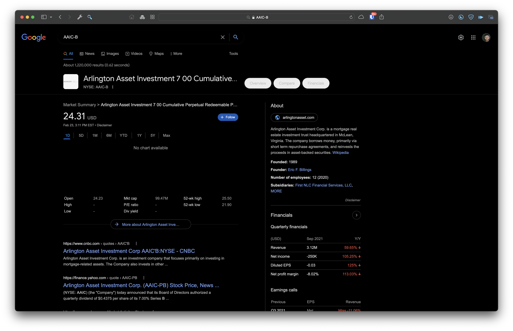

# Quiz 2

> Gus Lipkin

1. Look up Microsoft:

   - Give the Stock Ticker: **283.69**
   - Give the closing price of 2-23-22: **280.27**
   - What is their P/E: **29.819**
   - What is their dividend yield: **0.821**
   - 52-week high: **349.67**
   - 52-week low: **224.26**

2. Look up Kimberly Clark Corp:

   - Give the Stock Ticker: **127.58**
   - Give the closing price of 2-23-22: **131.94**
   - What is their P/E: **24.642**
   - What is their dividend yield: **3.456**
   - 52-week high: **145.79**
   - 52-week low: **125.27**

3. Use Google SEO and type (ibm corp bonds)

   Click the IBM 3.625% 2024 

   Pull up the ISIN and paste it in another browser tab

   1. Where is the bond listed?
      - **Boerse Frankfurt**
   2. What type of bond is this called
      - **US Listed Euro Bond**
   3. What is the Coupon?
      - **3.625%**
   4. What is the maturity?
      - **12/02/2024**

4. Type in Google SEO (List of preferred stocks)

   Or

   Use link https://stockmarketmba.com/listofpreferredstocks.php

   Grab the first symbol – AAIC-B and put in new search

   Take a snapshot and describe a few things about the preferred stock that you see

   - 
     Big thing I see is no one day chart. There’s something for every other time period but not today. The last time it was updated was yesterday at 3pm EST. I guess because it’s a real estate company, they not as active as others. There’s also not a lot of variation in their high and low prices across the year, granted it’s still a good percentage of their current value.