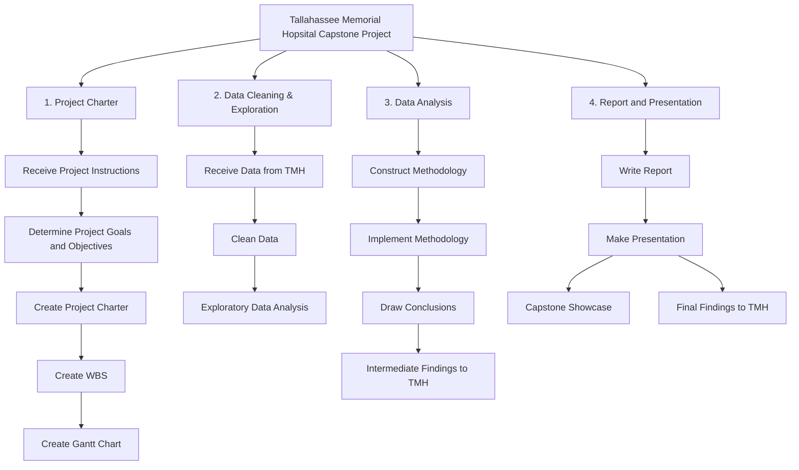
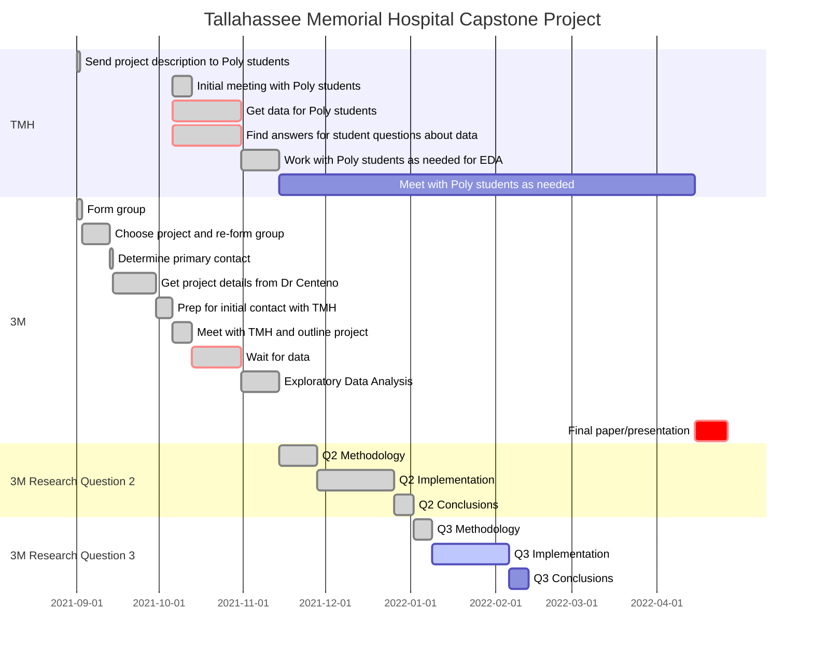

```mermaid
graph TD

A[Tallahassee Memorial Hopsital Capstone Project]
A-->B[1. Project Charter]
A-->C[2. Data Cleaning & Exploration]
A-->D[3. Data Analysis]
A-->E[4. Report and Presentation]

B-->b1[Receive Project Instructions]
b1-->b2[Determine Project Goals and Objectives]
b2-->b3[Create Project Charter]
b3-->b4[Create WBS]
b4-->b5[Create Gantt Chart]

C-->c1[Receive Data from TMH]
c1-->c2[Clean Data]
c2-->c3[Exploratory Data Analysis]

D-->d1[Construct Methodology]
d1-->d2[Implement Methodology]
d2-->d3[Draw Conclusions]
d3-->d4[Intermediate Findings to TMH]

E-->e1[Write Report]
e1-->e2[Make Presentation]
e2-->e3[Capstone Showcase]
e2-->e4[Final Findings to TMH]
```

```mermaid
gantt
dateFormat YYYY-MM-DD

title Tallahassee Memorial Hospital Capstone Project

section TMH
				Send project description to Poly students :done, tmh1, 2021-09-01, 1d
				Initial meeting with Poly students				:done, tmh2, 2021-10-06, 2021-10-13
        Get data for Poly students								:done, crit, tmh3, 2021-10-06, 2021-10-31
        Find answers for student questions about data :done, crit, tmh4, 2021-10-06, 2021-10-31
        Work with Poly students as needed for EDA	:done, tmh5, after p7, 2w
        Meet with Poly students as needed					: tmh6, after tmh5, 2022-04-15
section 3M
        Form group            										:done, p1, 2021-09-01, 2021-09-03
        Choose project and re-form group					:done, p2, 2021-09-03, 2021-09-13
        Determine primary contact									:done, p3, 2021-09-13, 2021-09-14
        Get project details from Dr Centeno				:done, p4, 2021-09-14, 2021-09-30
        Prep for initial contact with TMH					:done, p5, 2021-09-30, 2021-10-06
        Meet with TMH and outline project					:done, p6, 2021-10-06, 2021-10-13
        Wait for data															:done, crit, p7, 2021-10-13, 2021-10-31
        Exploratory Data Analysis									:done,	p8, after p7, 2w
        Extra research questions where possible		: p9, after q13, 2022-04-15
        Final paper/presentation									:crit, after p9, 2022-04-27
section 3M Research Question 2
				Q2 Methodology														:done, q21, after p8, 2w
				Q2 Implementation													:done, q22, after q21, 4w
				Q2 Conclusions														:done, q23, after q22, 1w
section 3M Research Question 3
				Q3 Methodology														:done, q31, after q23, 1w
				Q3 Implementation													:active, q32, after q31, 4w
				Q3 Conclusions														: q33, after q32, 1w
```
