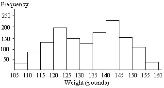

# Stat Learning Quizzes

## Review Quiz

1. Data were collected about students in a statistics class. Three variables were recorded for each student: number of siblings, student height and whether the student had previously taken a statistics course.What is the classification type of variable number of siblings?
   - **Discrete**
2. Data were collected about students in a statistics class. Three variables were recorded for each student: number of siblings, student height and whether the student had previously taken a statistics course. What type of variable is whether the student has previously taken a statistics course?
   - **Categorical**
3. Determine whether the total number of pumpkin spice latte drinks Tom can drink in a week is discrete or continuous?
   - **Discrete**
4. Determine the type of the following categorical variable Survey Responses Good, Better, Best
   - **Ordinal**
5. Determine the type of the following categorical variable Gender, Male, Female
   - **Nominal**
6. An education researcher randomly selects 38 schools from one school district and interviews all the teachers at each of the 38 schools. Identify the type of sampling used in this example.
   - **Cluster Sampling**
7. A researcher had selected 5 neighborhoods in a city based on different levels of average home sales price (e.g. <100K, 100-200K, 200K-350K, 350-500K, > 500K), and then randomly interviewed a sufficiently large random sample from each of these neighborhoods. Identify the type of sampling used in this example.
   - **Stratified Sampling**
8. Which of the following is not a measure of central tendency?
   - **Standard Deviation**
9. Which of the following is not a measure of variation in data?
   - **Median**
10. A frequency histogram is given below for the weights of a sample of college students. Identify the overall shape of the distribution
    
    - **Bimodal**
11. A die was rolled 200 times and a record was kept of the numbers obtained. The results are shown in the relative frequency histogram below. Identify the overall shape of the distribution
    
    - **Uniform**
12. A relative frequency histogram for the sale prices of homes sold in one city during 2006 is shown below. Identify the overall shape of the distribution
    
    - **Right Skewed**
13. Which measure divides a data set equally, such that half of the data values are above the measure and half of the data values are below the measure?
    - **Median**
14. Which measure of central tendency should be used with nominal data?
    - **Mode**
15. In a boxplot, observations that fall more than 1.5 times the IQR from either edge of the box are known as **Outliers**
16. In a boxplot, observations that fall more than 1.5 times the IQR from either edge of the box are known as **Never**
17. What is your point estimate if you are testing a hypothesis on a categorical variable with two values?
    - **Proportion**
18. The variable that changes due to the manipulation of the independent variable is called the **response variable**
19. When the correlation coefficient r is close to one, **there is a strong linear relationship between the two variables**
20. If a given value is within a 95%confidence interval, it will also be within a 99%confidence interval
    - **True**

## Linear Regression

1. A **Histogram** is a graph consisting of bars of equal width drawn adjacent to each other (without gaps). The horizontal scale represents classes of quantitative data values and the vertical scale represents frequencies. The heights of the bars correspond to the frequency values.
2. In a boxplot, observations that fall more than 1.5 times the IQR from either edge of the box are known as **Outliers**
3. If a given value is within a 95%confidence interval, it will also be within a 99%confidence interval **True**
4. When are p-value negative? 
   - **Never**
5. A classical method to determine the linear regression line aims to **minimize the sum of squared residuals**
6. The parameter that helps measure the fit of a linear regression model is **R-Square**
7. The intercept in a linear regression model represents **the expected value of y when x is zero**
8. The variable that changes due to the manipulation of the independent variable is called the **response variable**
9. **Regression** attempts to describe the dependence of a response variable on one or more explanatory variables
10. When the correlation coefficient r is close to one, **there is a strong linear relationship between the two variables**
11. Coefficient of determination explains the **proportion of total variation Y that is explained by X**
12. What is the command you use to obtain summary statistics in R? 
    - **`summary`**
14. You can use `head` or `glimpse` to preview the data 
    - **True**
15. What is the command you use to plot in R? 
    - **`ggplot`**
16. The Child Health and Development Studies investigated all pregnancies between 2000 and 2017 among women in the Kaiser Foundation Health Plan in the San Francisco Bay Area. The variables of interest are bwt (birth weight of babies), smoke (coded 1 if mother is a smoker), length of pregnancy in days (gestation), mother's age in years (age), mother's height in inches (height), and mother's pregnancy weight in pounds (weight). The results of a regression model for predicting the average birth weight of babies (bwt)on all of the variables included in the dataset is presented below. The R-square for the model is 0.749
    
    What is the coefficient of determination of the above model?
    - **0.749**
17. Find x and y
    $\begin{bmatrix} x+3 & 6 & 4y\\ 8 & y-9 & 2\\ 5 & 2x & -1 \end{bmatrix} = \begin{bmatrix} 9x+19 & 6 & -16\\ 8 & -13 & 2\\ 5 & -4 & -1 \end{bmatrix}$
    - **x = -2, y = -4**
18. The missing entry in the product of the following two matrices is
    $\begin{bmatrix} 1 & 0 \\ 2 & 1  \end{bmatrix} \begin{bmatrix} 1 & -1 \\ -2 & 1  \end{bmatrix}= \begin{bmatrix} 1 & -1 \\ ? & -1  \end{bmatrix}$
    - **0**
18. Given a matrix $X$, the expression $U\sum{} V^T$ denotes the **Singular Value Decomposition (SVD)** of $X$
20. Consider a matrix $X$ with singular values $\sigma_1, \sigma_2, ......\sigma_n$, which of the following is correct?
    - $\sigma_1\ge  \sigma_2\ge  ......\ge \sigma_n \ge 0$

## Linear Model Selection & Regularization

1. The method used to predict qualitative/categorical responses is called **Classification**
2. Logistic Regression is an example of supervised learning algorithm
   - **True**
3. Classification method cannot be used if your response variable has more than two categories
   - **False**
4. Which of the following methods do we use to best fit the model in logistic regression?
   - **Maximum Likelihood**
5. Suppose you have been given a fair coin and you want to find out the odds of getting heads. Which of the following is true?
   - **Odds will be 1**
6. Below are three scatter plots A, B and C and hand drawn decision boundaries for logistic regression. Which plot has a decision boundary that is overfitting the data? 
   
   - **C**
7. What does `glm` stand for?
   - **Generalized Linear Model**
8. What is the command you use to plot in R? 
   - **`ggplot`**
9. In logistic regression, we estimate logit (p) which is the log odds given as $ln(\frac{p}{1-p})$
   - **True**

The common brushtail possum of the Australia region is a bit cuter than its distant cousin, the American opossum. We consider 104 brushtail possums from two regions in Australia, where the possums may be considered a random sample from the population. The first region is Victoria, which is in the eastern half of Australia and traverses the southern coast. The second region consists of New South Wales and Queensland, which make up eastern and northeastern Australia.

We use logistic regression to differentiate between possums in these two regions. The outcome variable, called population, takes value 1 when a possum is from Victoria and 0 when it is from New South Wales or Queensland. We consider five predictors: sex_male (an indicator for a possum being male), head_length, skull_width, total_length, and tail_length. The logistic regression model is summarized in the following table.

10. The logistic regression equation for the above model is :

    - $$
      ln(\frac{p}{1-p})=39.2349-1.2376(\textrm{sex-male})-0.1601(\textrm{head-length})\\
      -0.2012(\textrm{skull-width})+0.6488(\textrm{total-length})-1.8708(\textrm{tail-length})
      $$

11. The above model indicates that at least one variable should be eliminated when using the p-value approach for variable selection? Which variable would you remove first and reestimate the model? 
    - **head_length**
    
12. You are predicting whether an email is spam or not. Based on the features, you obtained an estimated probability to be 0.75. What’s the meaning of this estimated probability? The threshold to differ the classes is 0.5
    - **The email is spam**
    
13.  Suppose that in our sample, following a logistic regression analysis, the odds for girls of having a positive attitude to school were 1.25. What proportion of girls would be expected to have a positive attitude?
    - **0.55**
    
14. In logistic regression, what do we estimate for one unit change in X? 
    - **Change in natural log of the odds for Y=1**
    
15. A total predicted logit of 0 can be transformed to a probability equal to **0.5**

16. Which variant of logistic regression is recommended when you have a categorical dependent variable with more than two values?
    - **Multinomial Logistic Regression**
    
17. Logistic regression assumes a **Linear relationship between continuous predictor variables and the logit of the outcome variable.**

18. In binary logistic regression **the dependent variable has two categories**

## Regularization

1. The following are accurate about the difference(s) between logistic regression and LDA? 

   - **If the classes are well separated, the parameter estimates for logistic regression can be unstable**
     **If the sample size is small and features are normally distributed for each class, linear discriminant analysis is more stable than logistic regression**

2. Which of the following method attempts to model the difference between the classes of data? 

   - **Discriminant Analysis**

3. In LDA the idea is to find the line that best separates the two classes. In the following image, which of the following is a good projection? 

   

   - **LD1**

4. The following snapshot shows the scatterplot of two features (X1 and X2) with class information (Red, Blue). Which of the following method would yield a better classification prediction?  

   

   - **LDA**

5. The following statements are true about LDA

   - **LDA is a linear transformation technique
     LDA is an example of supervised technique
     LDA maximizes the separation between different classes. **

6. QDA assumes shared variance across all the classes

   - **False**

7. In LDA, the discriminant functions for each of the classes are linear in terms of x. 

   - **True**

8. Overfitting occurs when you have more predictors than the number of observations

   - **True**

9. A classifier that classifies an observation x to the class for which $p_{_k}\left(x\right)$ is the largest will have the lowest possible error rate.

   - **True**

10. The following is accurate for QDA

    - **Observations from each class follow a Gaussian/Normal Distribution
      Each class has its own covariance matrix**

11. LDA is much less flexible than QDA and has substantially low variance leading to improved prediction performance. 

    - **True**

12. Which of the following are true about LDA and QDA? 

    - **LDA is better than QDA if there are relatively few training observations.**
      **If the assumption of common covariance classifier is unrealistic, QDA can be a better choice.**

13. ROC stands for **Receiver Operating Characteristics**

14. Larger the AUC, better the classifier

    - **True**

15. Use the following confusion matrix to answer the following questions:

    |           | True Default Status |      |      |       |
    | --------- | ------------------- | ---- | ---- | ----- |
    | Predicted |                     | No   | Yes  | Total |
    | Default   | No                  | 9320 | 128  | 9448  |
    | Status    | Yes                 | 347  | 205  | 552   |
    |           | Total               | 9667 | 333  | 10000 |

    - $\frac{9320+205}{10000}=95.25\%$

Use the following equations to answer the following questions.

16. Based on the following confusion matrix, what is the specificity?

    |           | True Default Status |      |      |       |
    | --------- | ------------------- | ---- | ---- | ----- |
    | Predicted |                     | No   | Yes  | Total |
    | Default   | No                  | 9320 | 128  | 9448  |
    | Status    | Yes                 | 347  | 205  | 552   |
    |           | Total               | 9667 | 333  | 10000 |

    - $\frac{9320}{128+9320}=98.64\%$

17. Based on the following confusion matrix, what is the precision?

    |           | True Default Status |      |      |       |
    | --------- | ------------------- | ---- | ---- | ----- |
    | Predicted |                     | No   | Yes  | Total |
    | Default   | No                  | 9320 | 128  | 9448  |
    | Status    | Yes                 | 347  | 205  | 552   |
    |           | Total               | 9667 | 333  | 10000 |

    - $\frac{205}{347+205}=31.13\%$

18. Which of the following are commonly used resampling techniques? 

    - **Crossvalidation and bootstrapping**

19. The following are techniques to hold out a portion of observations for test data.

    - **Validation Set Approach
      LOOCV
      k-fold Cross Validation**

20. The following are true.

    - **K-fold gives more accurate estimates of the test error rate than LOOCV due to bias-variance trade off
      In terms of bias, LOOCV is preferable to k-fold and k-fold is preferable to validation set approach
      In terms of variance k-fold is preferable to LOOCV and LOOCV is preferable to validation set**
